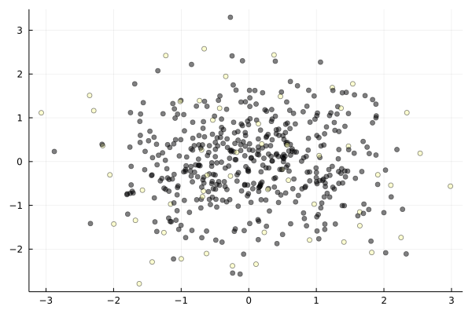

[](https://dahtah.github.io/DPP.jl/dev)

# DPP.jl: Determinantal Point Processes in Julia

Determinantal Point Processes are point processes with repulsion properties: define an appropriate function for representing similarity between items, and a DPP will sample a subset of "representative" items, i.e. ones that does not contain two items that are too similar.

This package focuses on discrete DPPs. Continuous DPPs are not supported (yet). Discrete DPPs may be defined from (extended) L-ensembles, or marginal kernels. We provide a very fast implementation of the exact sampling algorithm described in Tremblay et al. (2018). We also provide some basic tools for low-rank kernel approximation.

## Quick start

```{julia}
using DPP

x = randn(2,500) #some points in dim 2

#compute a kernel matrix for the points in x
L = [ exp(-norm(a-b)^2) for a in eachcol(x), b in eachcol(x) ]
dpp = EllEnsemble(L) #form an L-ensemble based on the L matrix
rescale!(dpp,50) #scale so that the expected size is 50
ind = sample(dpp) #a sample from the DPP (indices)

using Plots
scatter(x[1,:],x[2,:],marker_z = map((v) -> v ∈ ind, 1:size(x,2)),legend=:none,alpha=.75) #show the selected points in white
```



See package documentation for more.

## References

This package is used in the following articles and pre-prints:

- Barthelmé, S, Tremblay, N, Amblard, P-O, (2022)  A Faster Sampler for Discrete Determinantal Point Processes
- Tremblay, N., Barthelmé, S., & Amblard, P. O. (2019). Determinantal Point Processes for Coresets. J. Mach. Learn. Res., 20, 168-1. [arxiv.org/abs/1803.08700](https://arxiv.org/abs/1803.08700)
- Tremblay, N., Barthelmé, S., Usevich, K., & Amblard, P. O. (2021). Extended L-ensembles: a new representation for Determinantal Point Processes. arXiv preprint [arxiv.org/abs/2107.06345](https://arxiv.org/abs/2107.06345).
- Barthelmé, S., Tremblay, N., Usevich, K., & Amblard, P. O. (2021). Determinantal Point Processes in the Flat Limit. [arxiv.org/abs/2107.07213](https://arxiv.org/abs/2107.07213).
- Tremblay, N., Barthelmé, S., & Amblard, P. O. (2018). Optimized algorithms to sample determinantal point processes. [arxiv.org/abs/1802.08471](https://arxiv.org/abs/1802.08471).

The code to reproduce the figures in Barthelmé et al. (2022) is included in the misc/sampler directory.

## Authors

Simon Barthelmé (Gipsa-lab, CNRS), Nicolas Tremblay (Gipsa-lab, CNRS), Guillaume Gautier (CRIStAL). 


## See also

Another Julia toolkit for DPPs by Maruan Al-Shedivat is available [here](https://github.com/alshedivat/DeterminantalPointProcesses.jl).

For a full-featured DPP toolkit in Python, see
[DPPy](https://github.com/guilgautier/DPPy) by Guillaume Gautier.


